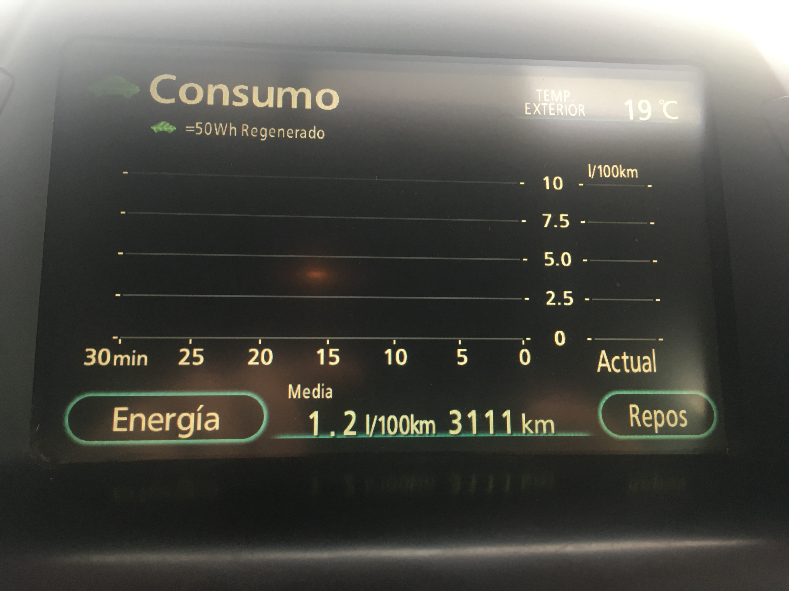
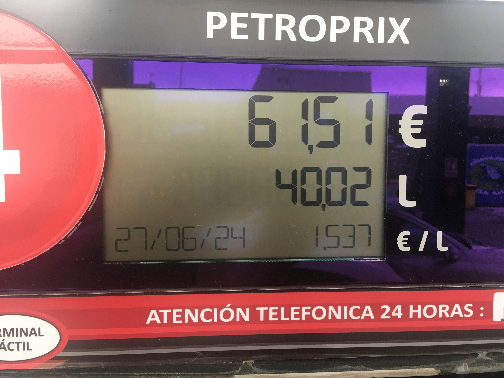
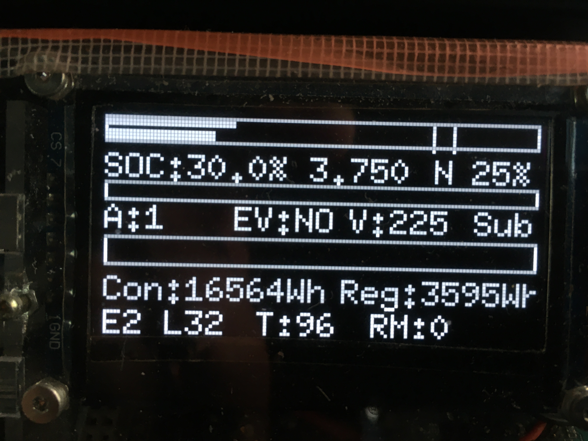

# Proyecto Prius: Conversión a Híbrido Enchufable 
- [Acceso a sistema de carga solar](https://github.com/Lorevalles/Cargador_Solar#proyecto-prius-estaci%C3%B3n-de-carga-solar)

## Introducción
Este proyecto busca transformar un Toyota Prius en un vehículo híbrido enchufable mediante pruebas de laboratorio y modificaciones técnicas específicas.

## Modificaciones y Procedimientos

### Alteración del Sensor de Intensidad de la Batería EV
- **Modelo de Sensor:** Sensor_intensidad_watchdog_millis_A0_V02_SIN
- **Objetivo:** Controlar de forma precisa la carga y descarga de la batería EV para mejorar la eficiencia del sistema híbrido.
- **Procedimiento:** Se realizarán ajustes controlados en el sensor para monitorizar y regular la intensidad de la batería EV, garantizando un rendimiento óptimo y la seguridad del sistema eléctrico.

### Acceso al CAN OBD del Vehículo
- **Herramientas Utilizadas:** USB_Canhacker_V2 y Comandos_EV_V2
- **Objetivo:** Integrar y optimizar el sistema de gestión del vehículo con la nueva configuración híbrida enchufable.
- **Procedimiento:** Mediante la interfaz OBD, se accederá a los sistemas de control del vehículo para ajustar los parámetros operativos del Prius transformado. Esta integración permitirá una supervisión en tiempo real y ajustes dinámicos durante las pruebas.

## Componentes Adicionales y Sustituciones
- **Circuito Simulador de Batería:** Esencial para las pruebas sin la batería original. Alternativamente, se puede mantener la batería original instalada.
- **Relés de Corte de Batería EV:** Sustitución por modelos TE Tyco HVDC EV200AAANA, capaces de manejar mayores intensidades y evitar problemas de funcionamiento debido a la intensidad superior de las baterías de litio.

## Notas Adicionales
A medida que el proyecto avance, se añadirá información detallada sobre los resultados de las pruebas, ajustes realizados y recomendaciones para futuras conversiones.

## Conclusiones Provisionales
Este proyecto no solo aspira a convertir el Toyota Prius en un modelo más eficiente y adaptable a tecnologías limpias, sino también a explorar las capacidades y limitaciones de los sistemas híbridos enchufables en vehículos existentes.

## Funcionalidad Principal

### Comunicación CAN:
- Utiliza la librería `due_can` para interactuar con el bus CAN.
- Configura filtros para capturar mensajes específicos de interés.
- Procesa mensajes CAN para monitorear parámetros como RPM, temperatura, voltaje y corriente.

### Pantalla OLED:
- Utiliza la librería `U8g2lib` para mostrar información en una pantalla OLED.
- Muestra estado del CAN, SOC (estado de carga de la batería), energía consumida/regenerada, voltaje y corriente.
- Muestra mensajes de error y operación normal.

### Control de Energía:
- Realiza seguimiento de la energía consumida y regenerada.
- Calcula estos valores basándose en el voltaje y corriente medidos.
- Muestra la energía acumulada y regenerada en la pantalla OLED.

### Monitoreo de Voltaje y SOC:
- Implementa control para monitorear y ajustar el voltaje y SOC de la batería.
- Usa umbrales predefinidos para niveles de SOC y voltaje.

### Histéresis y Control de Mensajes:
- Controla el envío de mensajes basados en condiciones específicas usando histéresis.
- Asegura estabilidad en lecturas de SOC y voltaje.

### Gestión de Dispositivos de Salida:
- Controla dispositivos de salida como relés basados en condiciones detectadas a través de CAN.
- Activa relés para gestionar el voltaje de acuerdo con parámetros de carga de la batería.

### Funcionalidad de Seguridad y Diagnóstico:
- Incluye funciones para borrar errores y manejar condiciones de error.
- Monitorea estado y activación de componentes clave.

### Interacción con el Usuario:
- Procesa entradas de botones e interruptores para realizar acciones como borrar errores o cambiar configuraciones.
- Muestra alertas visuales en la pantalla OLED en respuesta a interacciones del usuario.

### Gestión del Tiempo y Eventos:
- Usa temporizadores para gestionar intervalos de actualización y monitoreo.
- Realiza acciones periódicas como envío de mensajes y actualización de la pantalla.

### Imágenes del Proyecto

### Consumo Optimizado

### Repostado con 3111 Kilómetros

### Energía eléctrica en 160 Kilómetros.

### Datos de la Pantalla

1. **SOC:** Estado de carga de la batería EV, indicando la capacidad estimada. El 30.0% muestra la capacidad restante.
2. **3,750:** Valor medio de las celdas de litio en voltios.
3. **N 25%:** Capacidad estimada restante de la batería.
4. **V 225:** Voltaje total de la batería.
5. **Con:** Consumo eléctrico.
6. **Reg:** Energía regenerada.
7. **Capacidad de la batería:** 21.6 kW, cargada al 96% con descarga limitada al 25%.
8. **T:** Temperatura del motor de combustión.
9. **RM:** Revoluciones del motor.

### Circuitos electrónicos
- [Controlador carga de baterías](https://oshwlab.com/lorenzovv/limitador-de-carga-para-bater-as-3)
- [Alterador de la señal analógica para batería de alto voltaje EV EN LA ÚLTIMA VERSIÓN YA NO ES NECESARIO.](https://oshwlab.com/lorenzovv/alteraci-n-sensor-intensidad-corecci-n)
- [Simulador de presencia Batería EV](https://oshwlab.com/lorenzovv/simulacion-de-bateria-prius)
- [Cableado Arduino Due](https://github.com/Lorevalles/Proyecto_Prius/blob/main/due_can_SSD1309_SN65HVD230_001/Cableado_Arduino_Due.PNG)
  
## Lista de Materiales y Enlaces

### Baterías:
Las baterías utilizadas en este proyecto son unidades recicladas, procedentes de fábricas que las han desechado debido a modificaciones en sus líneas de fabricación. En principio, estas baterías no han sido instaladas nunca en ningún vehículo, por lo que su estado de uso es excelente, prácticamente como nuevas.
Es importante destacar que resulta difícil conseguir siempre los mismos modelos de baterías, debido a los cambios en las series de fabricación. Si necesitas baterías específicas, por favor envíame un <a href="mailto:lorenzovv@gmail.com" target="_blank">correo electrónico</a> para verificar las que podemos conseguir y las posibilidades de adaptación.
Para que tengas una idea, la adaptación de cada una de las tres baterías que he utilizado en la versión V2 ha requerido aproximadamente 180 horas de dedicación. Además, es crucial tener en cuenta el riesgo de cortocircuitos de alta intensidad. Por ello, debes idear un procedimiento adecuado para reducir los riesgos.
En ambas versiones, he dispuesto las baterías en módulos de 20S para minimizar riesgos y costes de fabricación.

### Enlaces 
Se abren por DEFECTO en ésta misma ventan, puedes abrirla en una nueva, con la oreja derecha del ratón.

- [Medidas de seguridad para la manipulación de baterías](https://github.com/Lorevalles/Proyecto_Prius/blob/main/Seguridad.md)
- [Baterías recicladas de alta calidad](mailto:lorenzovv@gmail.com)
- [Procedimiento de adaptación de baterías](https://github.com/Lorevalles/Proyecto_Prius/blob/main/Procedimiento.md)
- [Tiras níquel 0.1x5x25mm](https://es.aliexpress.com/item/33007254474.html?spm=a2g0o.order_list.order_list_main.15.2646194dvNHbQR&gatewayAdapt=glo2esp)
- [0.5 KG Tira de níquel puro 0.2x8 mm](https://es.aliexpress.com/item/32919726235.html?spm=a2g0o.order_list.order_list_main.10.2646194dvNHbQR&gatewayAdapt=glo2esp)
- [1 KG de níquel puro 0.8x28 mm](https://es.aliexpress.com/item/32888169005.html?spm=a2g0o.order_list.order_list_main.5.2646194dvNHbQR&gatewayAdapt=glo2esp)
- [Rollo de Tira de níquel Puro de 5 Metros 99,96%](https://amzn.eu/d/0dBJseQr)
- [GLITTER 801D Soldador por Puntos a Batería con Condensador de Energía de 12 KW](https://amzn.eu/d/0fjSk76k)
- [Succión de vapor de soldadura](https://amzn.eu/d/06UfybG1)
- [Cámara térmica E02](https://amzn.eu/d/0cpnbMK3)
- [Estación de Soldadura, Lytool Kit ](https://amzn.eu/d/0gwadudi)
- [Crimpadora Hidráulica 10T](https://amzn.eu/d/06LqdfpZ)
- [Conector ignífugo, 120A DC 1000V](https://es.aliexpress.com/item/1005004140400881.html?spm=a2g0o.order_list.order_list_main.698.1b3e194du39PzE&gatewayAdapt=glo2esp)
- [Cable de silicona alta temperatura 8AWG](https://amzn.eu/d/00wWIAyn)
- [Cable de silicona 6AWG para batería de coche eléctrico](https://es.aliexpress.com/item/1005004309348534.html?spm=a2g0o.order_list.order_list_main.858.1b3e194du39PzE&gatewayAdapt=glo2esp)
- [Cable AVSS de 10/50/100m para coche](https://es.aliexpress.com/item/1005005826825171.html?spm=a2g0o.order_list.order_list_main.878.1b3e194du39PzE&gatewayAdapt=glo2esp)
- [Conectores sellado de soldadura AWG26-24](https://es.aliexpress.com/item/1005004001131286.html?spm=a2g0o.order_list.order_list_main.708.1b3e194du39PzE&gatewayAdapt=glo2esp)
- [Terminales de conexión termorretráctiless oldadura impermeable](https://es.aliexpress.com/item/1005001379903443.html?spm=a2g0o.order_list.order_list_main.773.1b3e194du39PzE&gatewayAdapt=glo2esp)
- [Terminales de crimpado de batería](https://es.aliexpress.com/item/33017000828.html?spm=a2g0o.order_detail.order_detail_item.11.3c3139d3ZcZ0WW&gatewayAdapt=glo2esp)
- [Terminales Extremos de Cables de Batería](https://amzn.eu/d/016ss0Bm)
- [Cinta BGA de calor de alta temperatura](https://es.aliexpress.com/item/1005003746435714.html?spm=a2g0o.order_list.order_list_main.811.1b3e194du39PzE&gatewayAdapt=glo2esp)
- [Alcohol Isopropílico 99,9%](https://amzn.eu/d/04r8kx1u)

### Otros materiales

- [Módulo Pantalla OLED HD, SSD1309, 7 pines, interfaz Serial SPI](https://es.aliexpress.com/item/1005003097088323.html?spm=a2g0o.order_list.order_list_main.186.1b3e194du39PzE&gatewayAdapt=glo2esp)
- [Módulo de pantalla OLED de 2.4 pulgadas 128X64 IIC I2C](https://amzn.eu/d/0biks5XU)
- [2004 Acrylic Shell Soporte pantalla](https://es.aliexpress.com/item/32517589987.html?spm=a2g0o.order_list.order_list_main.201.1b3e194du39PzE&gatewayAdapt=glo2esp)
- [20S BALANCER BT Daly-equilibrador activo inteligente Bms](https://es.aliexpress.com/item/1005004464505967.html?spm=a2g0o.order_list.order_list_main.289.1b3e194du39PzE&gatewayAdapt=glo2esp)
- [84V 12A, EU adaptor Cargador rápido de batería de litio inteligente](https://es.aliexpress.com/item/1005006071316342.html?spm=a2g0o.productlist.main.15.1037d9Qvd9QvLX&algo_pvid=aace258a-533f-4749-98cd-09c339a1cfd3&aem_p4p_detail=2024071114431780522593691300001170184&utparam-url=scene%3Asearch%7Cquery_from%3A&search_p4p_id=2024071114431780522593691300001170184_2)
- [Arduino Due A000062](https://amzn.eu/d/0692ajdh)
- [Arduino Nano Every Single Board](https://amzn.eu/d/08zz2bVv)
- [Arduino UNO R4 Minima ABX00080 ](https://amzn.eu/d/0im1xDsN)
- [Arduino Nano A000005](https://amzn.eu/d/0dPSi0jP)
- [Controlador Nano Micro USB 3,0](https://es.aliexpress.com/item/1005002976480289.html?spm=a2g0o.order_list.order_list_main.509.1b3e194du39PzE&gatewayAdapt=glo2esp)
- [SN65HVD230 Can Board, CUIDADO hay otro más barato parece igual y sólo recibe](https://amzn.eu/d/016IDlav)
- [OBD2 ELM327 Lector de código](https://amzn.eu/d/05w8WHYE)
- [Divisor de Cable OBD de 1 a 3,male to 3 female](https://es.aliexpress.com/item/1005003077098918.html?spm=a2g0o.order_list.order_list_main.930.1b3e194du39PzE&gatewayAdapt=glo2esp)
- [Cable de extensión divisor 16 Pines, OBD2, OBDii, para Toyota](https://es.aliexpress.com/item/1005001315658150.html?spm=a2g0o.order_list.order_list_main.940.1b3e194du39PzE&gatewayAdapt=glo2esp)
- [Modulo Relay 5V 1-Canal](https://amzn.eu/d/0ia9llHN)
- [ADS1115 ADC 16bit 4 Canales](https://amzn.eu/d/0fTRFyMB)
- [CD74HC4067 CMOS 16 canales 16 CH Digital Multiplexor analógico](https://amzn.eu/d/03TwXtGh)
- [Conector de Panel de enchufe de aviación](https://es.aliexpress.com/item/1005004550846283.html?spm=a2g0o.order_list.order_list_main.599.1b3e194du39PzE&gatewayAdapt=glo2esp)

### Enlaces de interés

- [Y por supuesto me apunte aquí, una ayuda imprescindible ](https://programarfacil.com/blog/arduino-blog/curso-de-arduino/)
- [Diseño electrónico utilizado](https://easyeda.com/)
- [Componentes electrónicos](https://www.lcsc.com/)

